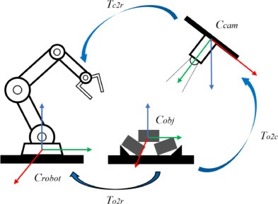

pybliometrics.sciencedirect.ObjectRetrieval
============================================

`ObjectRetrieval()` retrieves objects in a document using the `ScienceDirect Object Retrieval API <https://dev.elsevier.com/documentation/ObjectRetrievalAPI.wadl>`_.
All components of a Document that are not text (figures, formulas, etc.) are called `objects`.

.. currentmodule:: pybliometrics.sciencedirect 
.. contents:: Table of Contents
    :local:
    
Documentation
-------------

.. autoclass:: ObjectRetrieval
    :members:
    :inherited-members:

Examples
--------

Objects are uniquely identified by the `document id` and the `object filename`. To get the filename of an object you use the `ObjectMetadata` class.
Let's start by retrieving all object's filenames:
        
.. code-block:: python

    >>> from PIL import Image
    >>> from pybliometrics.sciencedirect import init, ObjectMetadata, ObjectRetrieval
    >>> init()
    >>> # Get all objects and its filenames
    >>> om = ObjectMetadata('10.1016/j.rcim.2020.102086')
    >>> all_filenames = [f.filename for f in om.results]
    >>> all_filenames
    ['gr13.jpg', 'gr9.jpg', 'gr12.jpg', ..., 'si98.svg', 'si99.svg', 'am.pdf']

In the following example, we retrieve the third object in the list (`gr12.jpg`), and display it using PIL:

.. code-block:: python

    >>> obj_ret = ObjectRetrieval('10.1016/j.rcim.2020.102086', all_filenames[2])
    >>> # Access object using the 'object' property and display using PIL
    >>> img = Image.open(obj_ret.object)
    >>>> img.show()

